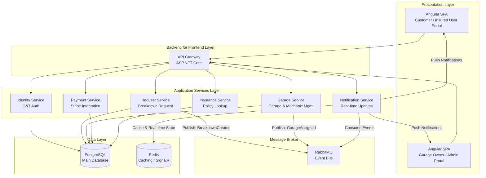

Here is a detailed architecture and project plan for a **Road Assistance Application** tailored to your tech stack: Angular, .NET Core, PostgreSQL, and RabbitMQ.

I have designed a system that effectively bridges the three core user groups you mentioned: **Customers** (stranded motorists), **Suppliers** (garage owners/mechanics), and **Insured Users** (those covered by a policy, which may include the customer).

### 🏗️ Proposed Architecture

A **Modular Monolith with Microservices Potential** is the most effective architectural style for this project. It allows you to build a single, deployable application with clear, bounded contexts. This makes it easier to manage initially, while still giving you the option to split services out later if the system scales.

Here is how the architecture would be structured:

### 🎯 Key Features for Each User Type

Drawing from real-world systems, we can define a clear set of features for each user role.

**1. Customers & Insured Users**
*   **Breakdown Request:** Submit a request with location (GPS), vehicle details, and breakdown type (e.g., flat tire, engine failure, out of fuel).
*   **Real-Time Tracking:** View the assigned mechanic's location and ETA on a map as they travel to the site.
*   **Service History:** Access a history of all past breakdown requests and services performed.
*   **Insurance Integration:** For insured users, automatically validate coverage for roadside assistance and streamline payment/claim processing.

**2. Supplier (Garage Owner/Mechanic)**
*   **Availability Toggle:** Set their availability status (online/offline) to manage incoming requests.
*   **Request Management:** View, accept, or decline incoming breakdown requests based on their location and capacity.
*   **Service Dashboard:** Manage their profile, service types offered (e.g., towing, tire change, minor repair), and service history.
*   **Customer Communication:** Securely communicate with the customer via in-app chat or status updates.

**3. Administrator**
*   **User & Garage Management:** Oversee all registered customers, mechanics, and garages. Verify and approve new garage owners.
*   **Platform Oversight:** Monitor the entire system, view service history, manage disputes, and handle reviews and ratings.
*   **Payment & Reconciliation:** Oversee payment flows and manage financial reconciliation between customers and garages.

### 🧩 Core Technology Implementation

*   **Backend (.NET Core)**: Use ASP.NET Core Web API to build RESTful services for each domain. Implement **Clean Architecture** to separate the Domain, Application, and Infrastructure layers, making the system maintainable and testable. Use **MassTransit** to simplify communication with RabbitMQ.
*   **Frontend (Angular)**: Build two separate SPAs or a single SPA with role-based routing. Use **Angular Material** or a similar component library for a responsive UI. Manage complex state (e.g., live request tracking) with **NgRx**, which you'll find in many professional Angular projects.
*   **Database (PostgreSQL)**: Design a robust schema with tables for Users (with role-specific fields), Garages, Mechanics, Vehicles, Breakdown Requests (with status, location, timestamps), and Insurance Policies. Use **Entity Framework Core** as your ORM.
*   **Message Broker (RabbitMQ)**: Use this to decouple your services. For example, when a breakdown request is created, the `Request Service` publishes a `BreakdownCreatedEvent`. The `Garage Service` consumes this event to find and assign a nearby mechanic, and the `Notification Service` consumes it to send alerts.
*   **Real-Time Features (SignalR)**: Implement **SignalR** alongside RabbitMQ for instant, low-latency communication from the server to the Angular client, which is perfect for live location tracking and status updates.

### 📝 High-Level Project Plan (MVP)

1.  **Setup & Core User Management**: Set up the Angular and .NET Core projects. Implement JWT authentication and the base user registration/login flows for the three user types.
2.  **Garage & Mechanic Management**: Build the supplier portal where garage owners can register, manage their profile, and set their availability.
3.  **Breakdown Request & Assignment Flow**: Implement the core customer flow: create a request, use an algorithm to find the nearest available mechanic (e.g., based on postal code or geo-location in the database), and send the request via RabbitMQ.
4.  **Real-Time Tracking**: Integrate a map API (like Google Maps or Leaflet) for both the customer (tracking their assigned mechanic) and the mechanic (navigating to the customer's location). Use SignalR for this.
5.  **Notification System**: Build a notification service that uses RabbitMQ to listen for key events (e.g., request accepted, mechanic en route) and sends real-time updates to the client.

### 🚀 Suggested Project Name

**RoadLink Assist** – This name clearly conveys the platform's purpose of connecting stranded drivers with assistance providers.

This architecture provides a solid, modern foundation for your project. Starting with this structure will allow you to build a robust, scalable, and feature-rich road assistance application.

Would you like me to elaborate on any specific part of this architecture, such as the database schema design or the flow for handling a breakdown request?
